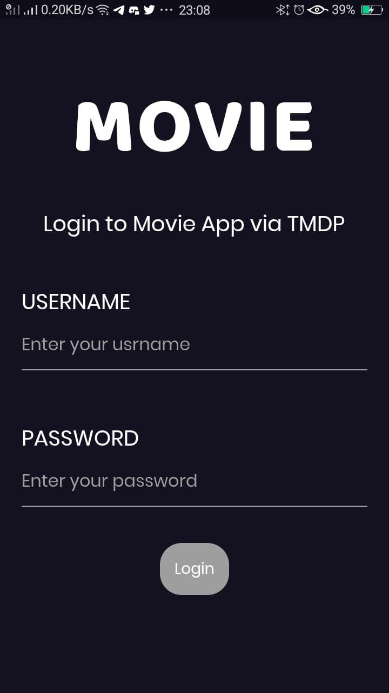
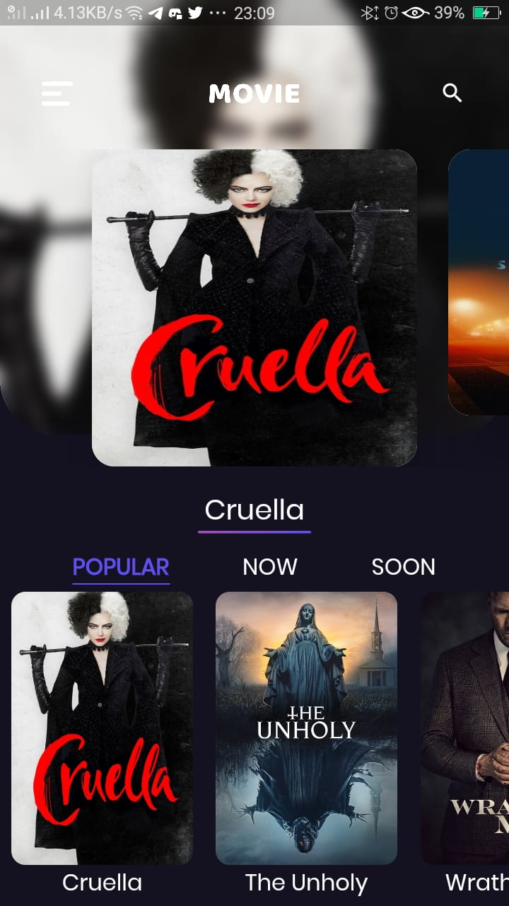
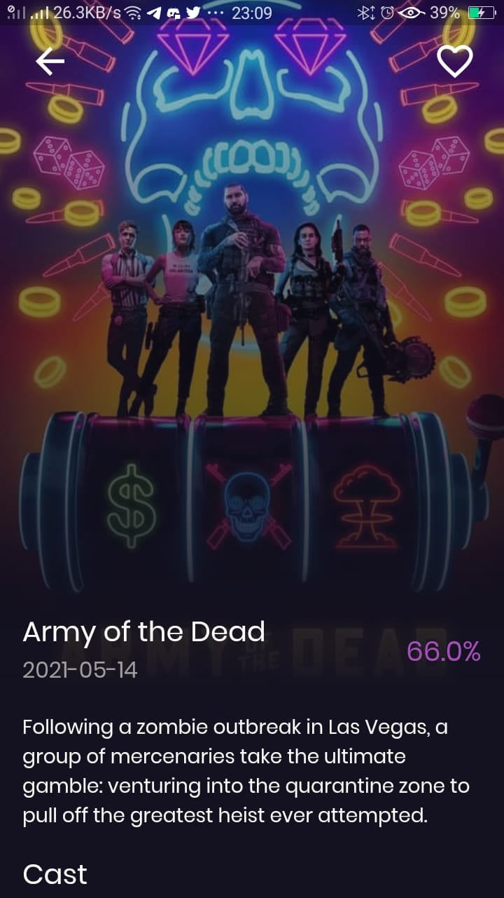
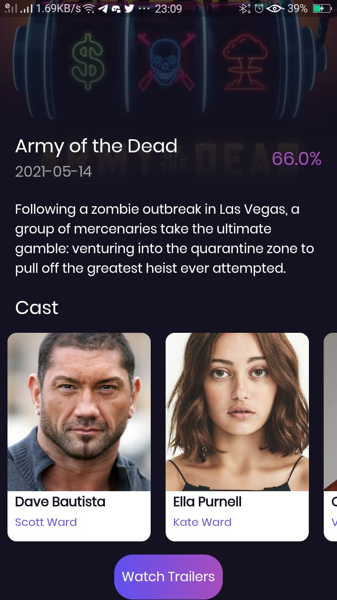
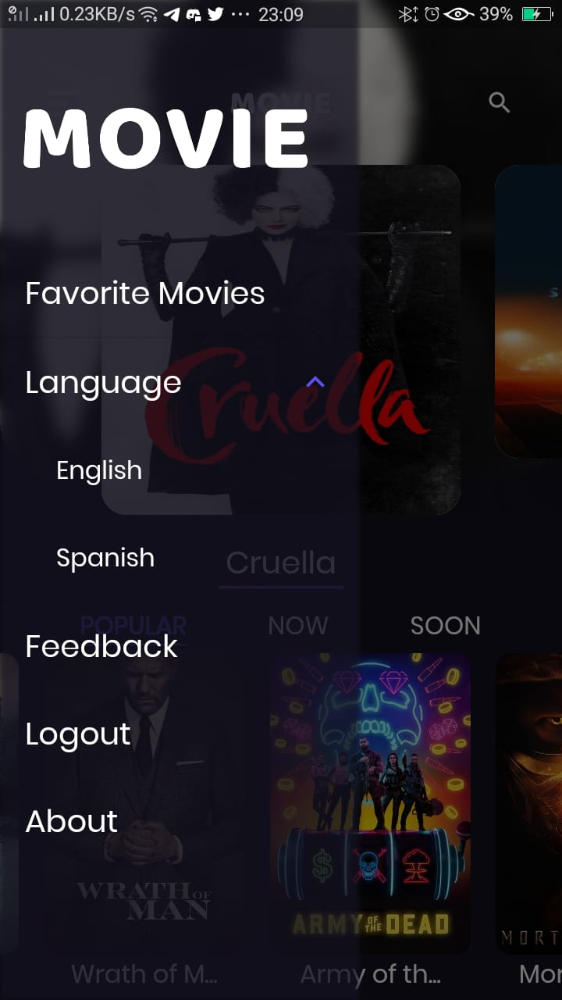
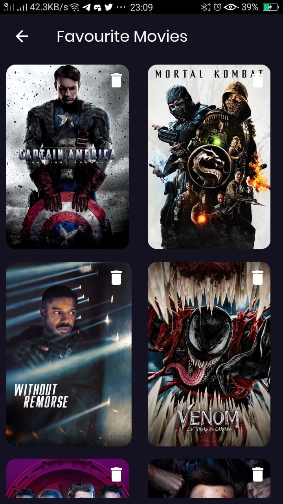
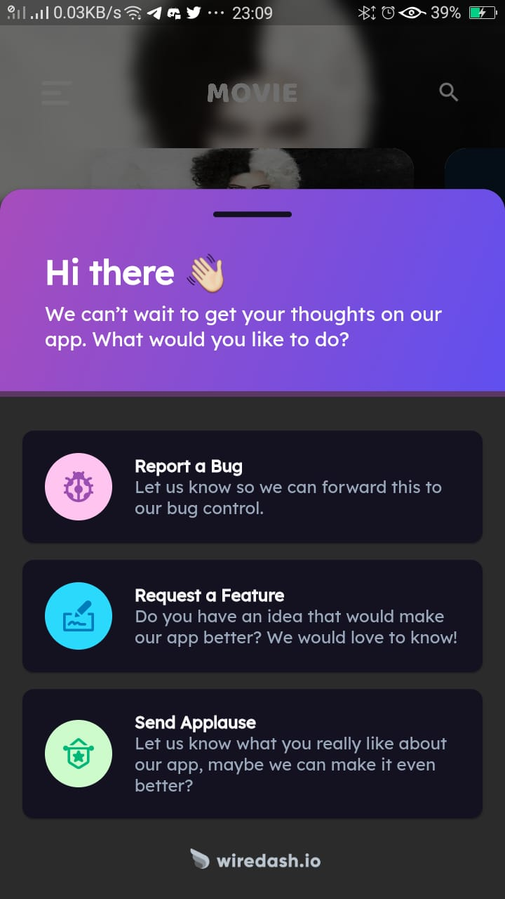
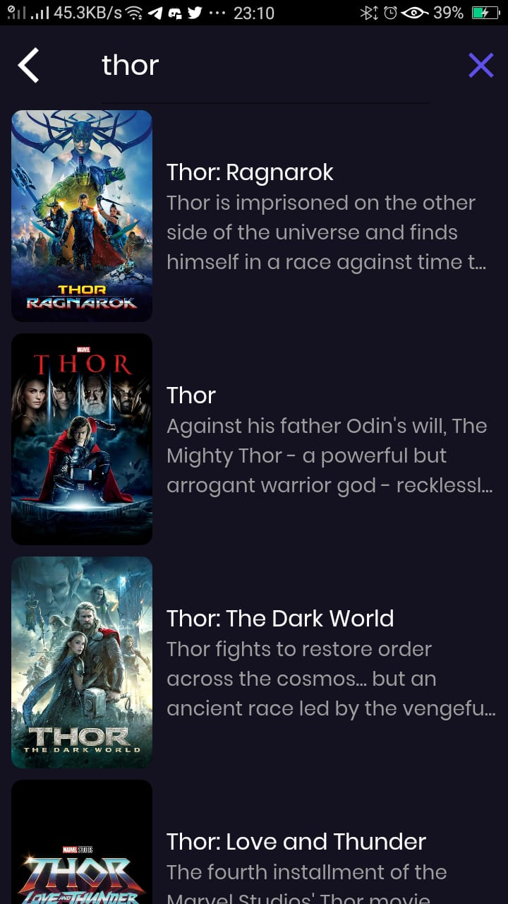

# Movie Split

It's a movie application that I have created by using the Flutter framework. I am developing the application for Education purposes and learning flutter concepts from the Youtube Channel "Techie Blossom" and If you like it you can really follow him.

## Highlights 

- It is based on Clean Architecture
- Used TMDB API for movies database
- Intensively used Bloc for state management
- Implemented "get" HTTP requests for various API calls like for Trending, coming soon, popular movies, etc.
- Implemented user Authentication
- Implemented "post" HTTP request in Authentication
- Added movies searching
- Has multiple language support (English, Spanish)
- Added feedback system using wiredash
- Has the support of local database storage using Hive 
- Implemented favorite movies feature
- Many more to come.

## Images
#### Authentication Screen 

#### Home Screen

#### Detail Screen

#### Detail Bottom Screen

#### Drawer

#### Favourite Screen

#### Feedback Screen

#### Search Screen

